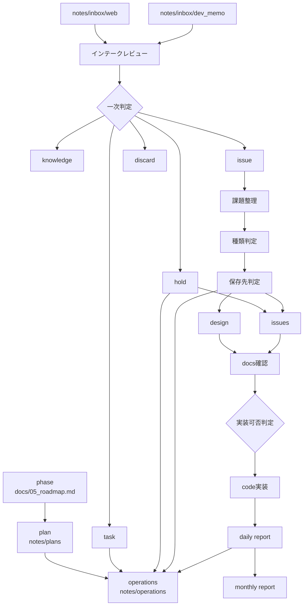

# 2026-03-27 Development Flow Diagram Draft

## 概要

現時点で整理した標準開発フローを図として表現したたたき台。

計画レイヤー、入力レイヤー、実行レイヤー、レビュー更新レイヤーの接続を見える化することを目的とする。

本メモは会話由来の未整理入力メモであり、正式仕様ではない。

---

## 1. 簡易フロー図

```text
入力ソース
├─ inbox/web
└─ inbox/dev_memo
        ↓
インテークレビュー
- フォルダ全体を読む
- 内容を統合する
- テーマを抽出する
        ↓
一次判定
├─ knowledge
├─ issue
├─ task
├─ hold
└─ discard
```

---

## 2. 全体フロー図

```text
phase（docs/05_roadmap.md）
        ↓
plan（notes/plans/）
        ↓
operations（notes/operations/）
        ↓
────────────────────────
入力ソース
├─ notes/inbox/web
└─ notes/inbox/dev_memo
        ↓
インテークレビュー
- フォルダ全体読取
- 統合整理
- テーマ抽出
        ↓
一次判定
├─ knowledge → 知識系の整理先
├─ issue     → 課題整理へ
├─ task      → operations へ
├─ hold      → operations/Later or issues/open
└─ discard   → delete
────────────────────────
        ↓
issue の場合
        ↓
課題整理
        ↓
種類判定
        ↓
保存先判定
├─ issues
├─ design
└─ operations
        ↓
必要なら design
        ↓
docs 確認
        ↓
実装可否判定
        ↓
code 実装
        ↓
daily report
        ↓
operations 更新
        ↓
monthly report
```

---

## 3. レイヤー分解図

```text
[計画レイヤー]
phase
↓
plan
↓
operations

[入力レイヤー]
inbox/web
inbox/dev_memo
↓
インテークレビュー
↓
一次判定

[実行レイヤー]
issue
↓
課題整理
↓
design
↓
docs確認
↓
実装

[レビュー/更新レイヤー]
daily report
↓
operations 更新
↓
monthly report
```

---

## 4. Mermaid 図



---

## 5. 補足

今後、以下を詰めることで図の精度を上げる必要がある。

- notes/plans/ の実際の単位
- operations の週次ファイル形式
- issues / design / operations の接続条件
- knowledge の正式保存先
- archive / delete の条件

本図は、標準開発フロー設計の途中整理として扱う。
